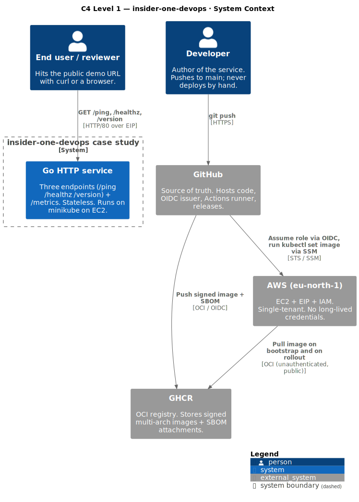
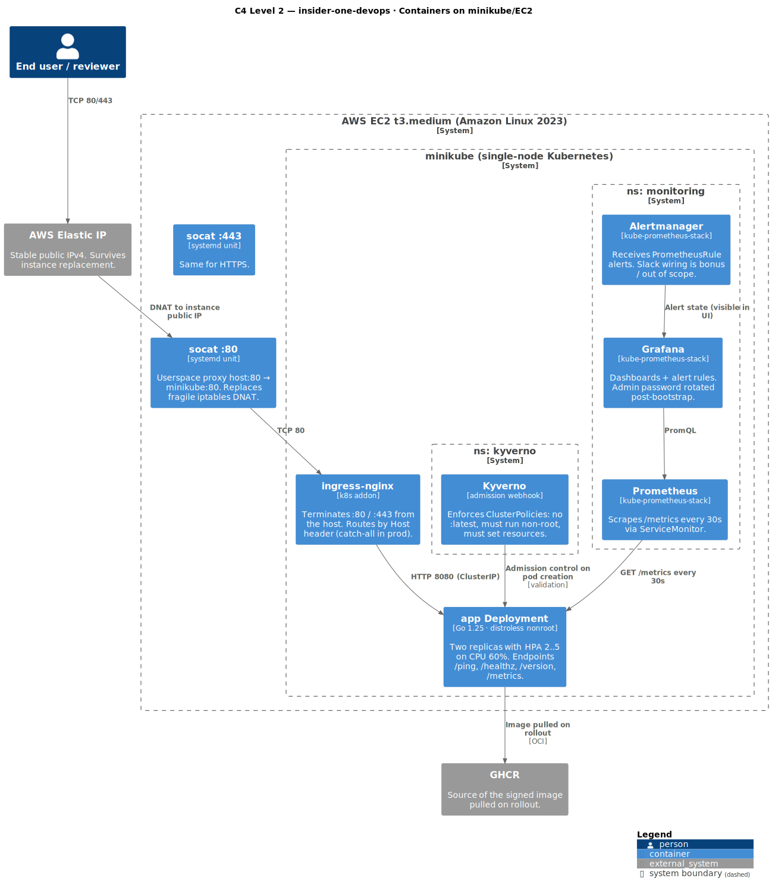
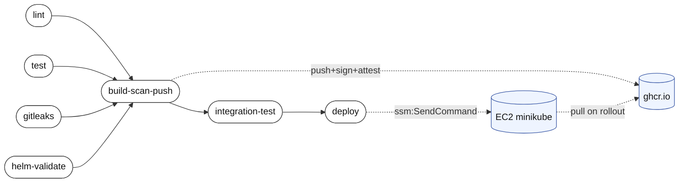
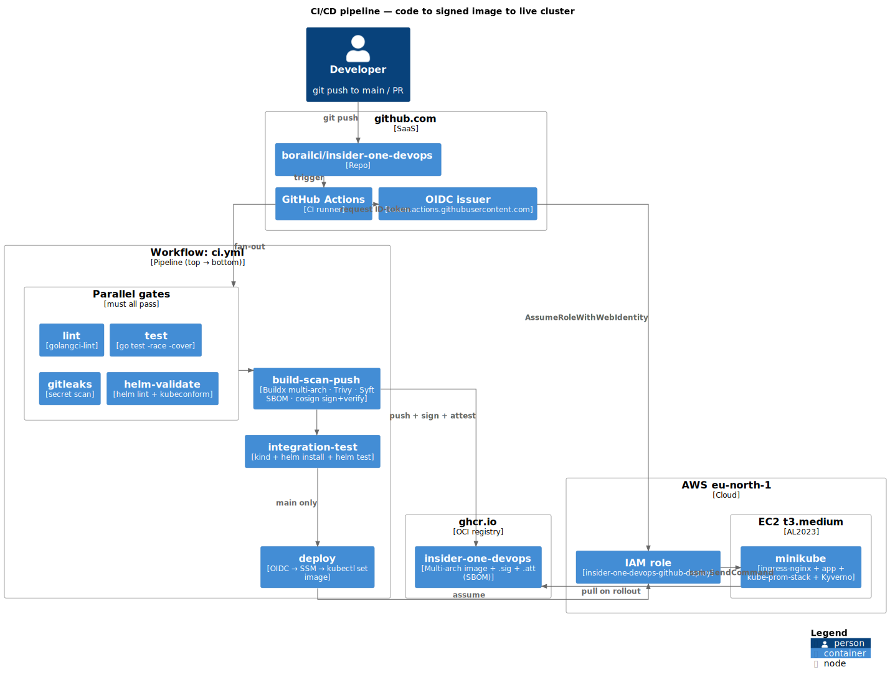

# Architecture

The system is intentionally small: one stateless Go service, one Kubernetes cluster (minikube on EC2), one CI pipeline, one observability stack. Every box below traces to one or more requirements in [`SPEC.md`](../SPEC.md).

## Diagrams (C4 model, PlantUML)

Source `.puml` files live in [`docs/diagrams/`](diagrams/) and use the [C4-PlantUML](https://github.com/plantuml-stdlib/C4-PlantUML) macros. Run `make diagrams` to re-render — `make diagrams-check` runs in CI and fails when committed SVGs drift from source.

### Level 1 — System context



Source: [`diagrams/context.puml`](diagrams/context.puml). Shows the external actors (end user, developer) and the three external systems the case study integrates with (GitHub, GHCR, AWS).

### Level 2 — Containers



Source: [`diagrams/container.puml`](diagrams/container.puml). Decomposes the case-study system into the components that actually run on the EC2 host: ingress-nginx, the Go service Deployment, kube-prometheus-stack, Kyverno, and the two socat systemd units bridging host ports 80/443 to the minikube IP.

### Deployment / CI/CD

Two views — a short Mermaid pipeline (renders natively on GitHub, no overlap) and a fuller PlantUML deployment view for the AWS/EC2 side.

#### Pipeline (GitHub Actions–style, left → right)

Same shape as the **Actions → Workflow** graph on github.com: parallel jobs stack vertically, dependencies flow left to right.



Reads like the Actions UI: four parallel gates on the left, then build → integration → deploy single-track on the right. Side artifacts (GHCR push, EC2 rollout) shown with dashed lines so they don't clutter the main chain.

<details>
<summary>Strict C4 deployment view (PlantUML SVG — click to expand)</summary>



Source: [`diagrams/deployment.puml`](diagrams/deployment.puml). Same content as the Mermaid above, in C4-PlantUML notation. Open the raw SVG ([link](diagrams/deployment.svg)) to read it at native size — the in-line render is downscaled by GitHub.

</details>

<details>
<summary>Click for the original ASCII topology (terminal-friendly view)</summary>

## Topology

```
                                ┌───────────────────────────────────────────┐
                                │              github.com                   │
                                │                                           │
   developer ──push/PR─►   ┌────┴────────┐  webhook    ┌────────────────┐   │
                           │  borailci/  │────────────►│ GitHub Actions │   │
                           │ insider-one-│             │     (CI)       │   │
                           │   devops    │             └────────┬───────┘   │
                           └────┬────────┘                      │           │
                                │  push image                   │           │
                                │  ghcr.io/<owner>/             │           │
                                │  insider-one-devops:<sha>     │           │
                                ▼                               │           │
                           ┌─────────────┐                      │           │
                           │    GHCR     │◄─── docker login ────┘           │
                           └─────────────┘                                  │
                                                                            │
                                  OIDC AssumeRoleWithWebIdentity            │
                                ┌─────────────────────────────────────────► │
                                ▼                                           │
   ┌───────────── AWS (eu-north-1) ────────────────┐                         │
   │                                              │                         │
   │   ┌──────────────┐    ┌───────────────────┐  │                         │
   │   │ IAM role     │    │ SSM SendCommand   │  │                         │
   │   │ insider-one- │    │  → EC2 instance   │  │                         │
   │   │ devops-      │    │  → kubectl set    │  │                         │
   │   │ github-      │    │    image          │  │                         │
   │   │ deploy       │    └─────────┬─────────┘  │                         │
   │   └──────────────┘              │            │                         │
   │                                 ▼            │                         │
   │   ┌────────── EC2 t3.micro (AL2023) ──────┐  │                         │
   │   │                                       │  │                         │
   │   │   ┌───────────────────────────────┐   │  │                         │
   │   │   │           minikube            │   │  │                         │
   │   │   │   ┌─────────────────────┐     │   │  │                         │
   │   │   │   │     ingress-nginx   │◄────┼───┼──┼── 80/443  ──────────────┤
   │   │   │   └──────────┬──────────┘     │   │  │   Elastic IP            │
   │   │   │              │ Host: app...   │   │  │                         │
   │   │   │              ▼                │   │  │                         │
   │   │   │       ┌──────────────┐        │   │  │                         │
   │   │   │       │ Service / app│        │   │  │                         │
   │   │   │       │  ClusterIP   │        │   │  │                         │
   │   │   │       └──────┬───────┘        │   │  │                         │
   │   │   │              ▼                │   │  │                         │
   │   │   │       ┌──────────────┐        │   │  │                         │
   │   │   │       │ Deployment   │        │   │  │                         │
   │   │   │       │  app (Go)    │        │   │  │                         │
   │   │   │       │ /ping        │        │   │  │                         │
   │   │   │       │ /healthz     │        │   │  │                         │
   │   │   │       │ /version     │        │   │  │                         │
   │   │   │       │ /metrics     │◄───────┼───┼──┼── scrape ───────────────┤
   │   │   │       └──────────────┘        │   │  │                         │
   │   │   │                               │   │  │                         │
   │   │   │   ┌─── ns: monitoring ────┐   │   │  │                         │
   │   │   │   │  kube-prometheus-     │   │   │  │                         │
   │   │   │   │  stack (best effort   │   │   │  │                         │
   │   │   │   │  on t3.micro)         │   │   │  │                         │
   │   │   │   │  • Prometheus         │   │   │  │                         │
   │   │   │   │  • Grafana            │   │   │  │                         │
   │   │   │   │  • Alertmanager       │   │   │  │                         │
   │   │   │   └───────────────────────┘   │   │  │                         │
   │   │   └───────────────────────────────┘   │  │                         │
   │   └───────────────────────────────────────┘  │                         │
   └──────────────────────────────────────────────┘                         │
                                                                            │
                                              ┌─────────────────────────────┘
                                              │
                                          end user
                                          (curl / browser)
```

</details>

## Component map → requirements

| Component                          | SPEC ref                | File path                                                 |
|------------------------------------|-------------------------|-----------------------------------------------------------|
| Go service (`/ping /healthz /version /metrics`) | FR-1..FR-8              | `main.go`, `main_test.go`                                 |
| Multi-stage distroless image       | FR-9..FR-11, NFR-2..3   | `Dockerfile`                                              |
| GHCR registry push                 | FR-12, AC-13            | `.github/workflows/ci.yml` → `build-scan-push` job        |
| Helm chart (Deploy/Svc/Ingress/CM) | FR-13..FR-18            | `charts/app/`                                             |
| GH Actions pipeline                | FR-19..FR-22, NFR-9     | `.github/workflows/ci.yml`                                |
| GitHub OIDC ↔ AWS                  | FR-21, AC-25            | `terraform/iam-oidc.tf`                                   |
| EC2 + EIP + Security Group         | FR-23, AC-26, AC-28     | `terraform/ec2.tf`                                        |
| Bootstrap (docker + minikube + helm) | FR-24, AC-27          | `scripts/bootstrap-ec2.sh`                                |
| kube-prometheus-stack              | FR-26                   | `scripts/bootstrap-ec2.sh` (helm install step)            |
| ServiceMonitor                     | FR-27, AC-30            | `charts/app/templates/servicemonitor.yaml`                |
| Grafana dashboard                  | FR-28, AC-31            | `dashboards/app.json`                                     |
| PrometheusRule alert               | FR-29, AC-32            | `charts/app/templates/prometheusrule.yaml`                |
| RUNBOOK / SECURITY / ADRs          | FR-30..FR-33            | `RUNBOOK.md`, `SECURITY.md`, `docs/adr/`                  |

## Trust boundaries

1. **GitHub Actions → AWS.** The CI deploy job assumes `insider-one-devops-github-deploy` via OIDC. The trust policy restricts the `sub` claim to `repo:borailci/insider-one-devops:ref:refs/heads/main` and `…:environment:prod`. No long-lived AWS keys exist in the repo or GH secrets.
2. **AWS → EC2.** CI never opens a port on the EC2 host. It calls `ssm:SendCommand` against the instance, which uses the SSM agent running on the host with `AmazonSSMManagedInstanceCore`. The Security Group's only inbound rules are 22 (operator CIDR), 80, 443 — the Kubernetes API is **not** exposed.
3. **Public → ingress.** All inbound from the internet terminates at `ingress-nginx` on the host, then routes by `Host` header to the in-cluster Service. The app container itself listens on 8080 inside the pod and is never directly reachable from outside.
4. **GHCR.** Image pulls on EC2 are unauthenticated (public package). Pushes from CI use `GITHUB_TOKEN` with `packages: write`.

## Data flow on a normal request

1. Client `curl http://<EIP>/ping -H 'Host: app.insider-one.example'`.
2. iptables PREROUTING DNATs `<EIP>:80` → minikube IP `:80` (set up by bootstrap).
3. `ingress-nginx` matches the host header and forwards to Service `app-app:80`.
4. Service routes to a pod IP on port 8080.
5. Go handler logs an access-log line (JSON), increments `http_requests_total{path="/ping",status="200"}`, returns `pong`.
6. Response retraces the path. `X-Request-ID` is set on the way back.
